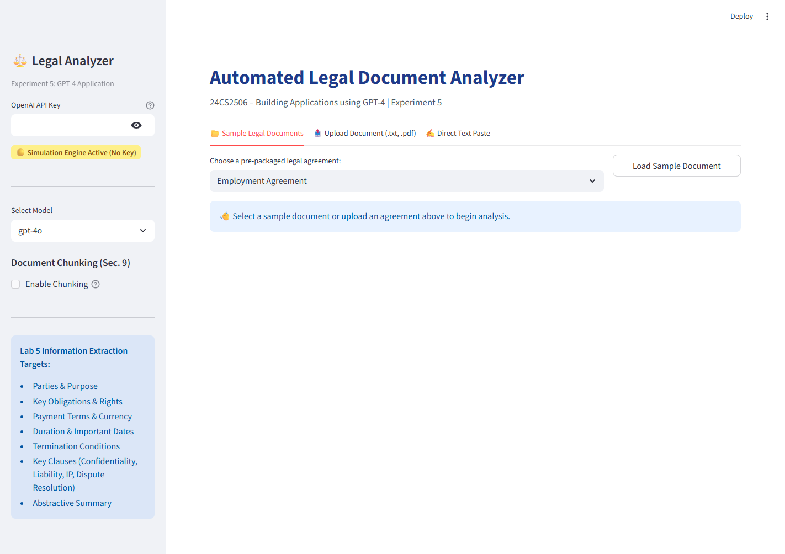
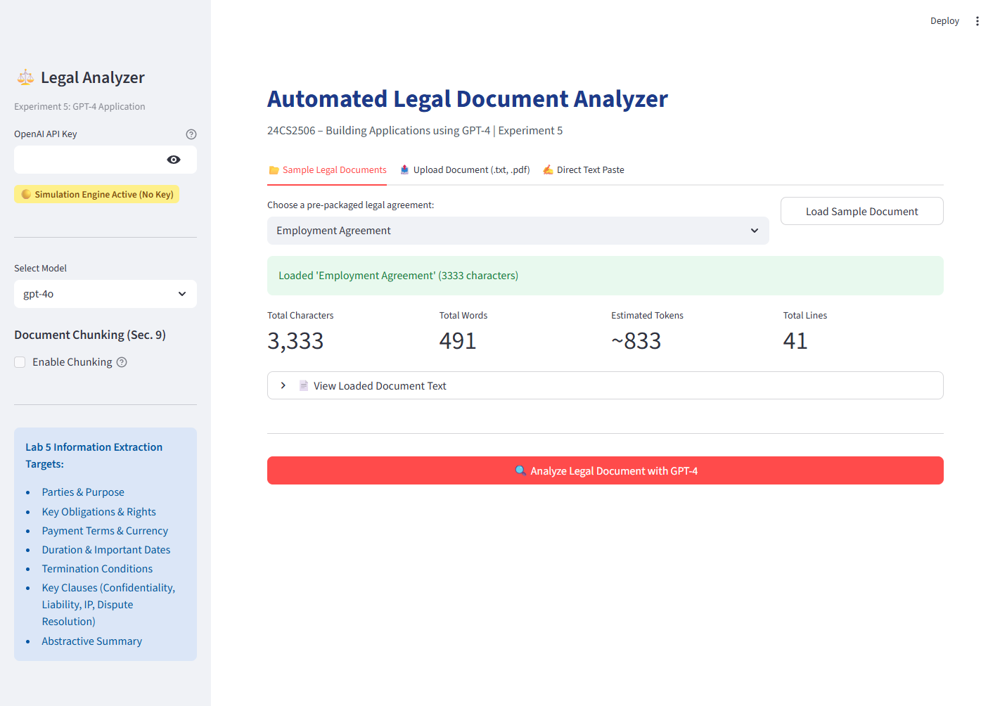
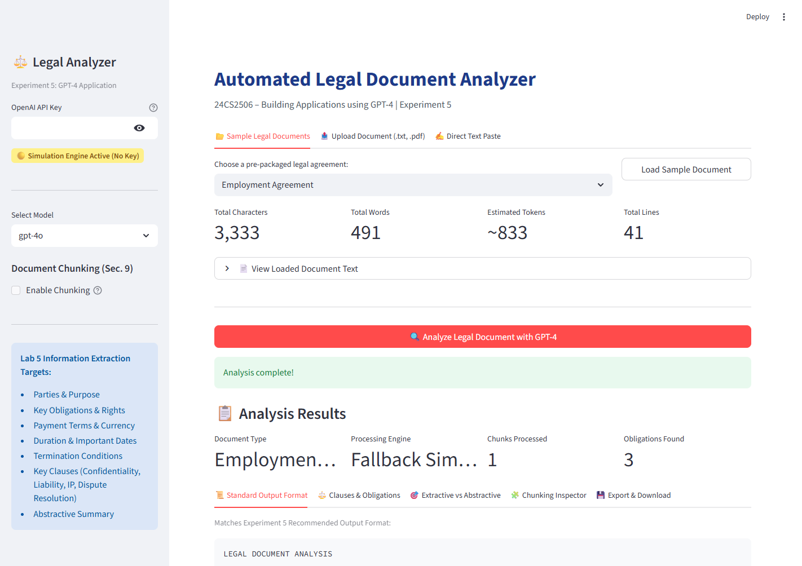

# 24CS2506 – Building Applications using GPT-4
## Experiment 5: Automated Legal Document Analyzer using GPT-4

[](#7-running-automated-tests)
[](https://www.python.org/)
[](https://streamlit.io/)

---

## 1. Overview & Features

Legal documents are often lengthy, linguistically intricate, and filled with specialized legal jargon, conditional clauses, exceptions, and cross-references. Manually analyzing contracts to extract key responsibilities, payment schedules, duration, liabilities, and termination conditions is both tedious and prone to human oversight.

This project implements an **Automated Legal Document Analyzer using GPT-4**, designed to extract key contractual provisions, analyze risk-bearing clauses, handle document chunking for extensive agreements, and generate abstractive summaries adhering to rigorous prompt constraints without hallucinations.

### Key Features
- **Multi-Format Document Extraction**: Extracts and preprocesses text from raw strings, `.txt` files, and `.pdf` documents using `pypdf`.
- **Intelligent Section & Document Chunking (Section 9)**: Splits long, multi-section commercial agreements into coherent chunks with overlap preservation, analyzes each section, and synthesizes a consolidated report.
- **Constrained Prompt Engineering (Section 5)**: Explicit zero-hallucination prompts enforcing extraction strictly from document facts.
- **Dual Execution Engine**:
  - **Live API Mode**: Connects directly to OpenAI GPT-4 models (`gpt-4o`, `gpt-4`, `gpt-4o-mini`).
  - **Simulation / Fallback Mode**: Intelligent rule-based and heuristic engine (`FallbackAnalyzer`) that executes full extraction offline without requiring an API key or incurring costs.
- **Strict Standard Output Schema**: Produces formatted outputs adhering strictly to the lab manual's Recommended Output Format.
- **Interactive Streamlit Web Dashboard**: Visual dashboards featuring clause cards, extractive vs. abstractive comparisons, chunk inspectors, and export options (TXT, JSON, Markdown).
- **Command-Line Interface (CLI)**: Interactive terminal tool supporting direct arguments (`--file`, `--chunk`, `--model`, `--output`).
- **Comprehensive Automated Test Suite**: 16 unit and integration test cases covering extraction, chunking, prompts, schema compliance, and fallbacks.

---

## 2. Key Concepts Covered (Lab Syllabus)

### 1. What is a Legal Document?
A legal document is a formal written instrument that defines legal rights, responsibilities, obligations, agreements, or procedures between two or more parties.
- **Common Examples**:
  - Employment Agreement
  - Non-Disclosure Agreement (NDA)
  - Master Software Services Agreement (MSA)
  - Commercial Lease / Rental Agreement
  - Sales Agreement
  - Loan Agreement
  - Terms of Service & Privacy Policy

### 2. What is Legal Document Analysis?
Examining a contract to identify:
- **Parties involved** (Entities, titles, representations)
- **Purpose** (Core objective of the agreement)
- **Obligations & Rights** (What each party must or must not do)
- **Financial Terms** (Payment, amounts, milestones, invoicing, currency)
- **Duration & Term** (Start date, duration, renewal mechanisms)
- **Termination Conditions** (Notice periods, breach remedy timelines, convenience exits)
- **Confidentiality Requirements** (Scope of protected data, survival periods)
- **Governing Law & Dispute Resolution** (Arbitration venues, applicable legal code)

### 3. Why is Legal Document Analysis Difficult?
- Complex legal terminology (*indemnification, force majeure, liquidated damages*)
- Long nested sentences and conditional phrasing
- Multi-party cross-references and schedules
- Exceptions, caveats, and survival clauses
- Sheer volume of text in enterprise contracts

### 4. What is Legal Document Summarization?
Distilling lengthy legal agreements into concise summaries that preserve critical legal meaning while eliminating boilerplate verbiage.
$$\text{Long Legal Document} \xrightarrow{\quad\text{GPT-4}\quad} \text{Concise Abstractive Summary}$$

### 5. Components of a Good Legal Analysis Prompt
A reliable prompt enforces zero-hallucination constraints:
- **Role**: `You are a professional legal document analysis assistant.`
- **Task**: `Analyze and summarize the provided legal document.`
- **Information to Extract**: Parties, Purpose, Obligations, Payment terms, Duration, Termination, Important dates.
- **Constraint**: `Use ONLY information present in the document. Do NOT invent facts or extrapolate unsupported details.`
- **Output Format**: Headings and bullet points matching the standard schema.

### 6. Key Clause Identification
The analyzer inspects and categorizes six critical contract clauses:
1. **Confidentiality**: Protection standards, exclusions, survival terms.
2. **Payment**: Schedules, milestones, taxes, interest on default.
3. **Termination**: Notice requirements, for-cause vs for-convenience exit conditions.
4. **Liability**: Aggregate monetary liability caps, exclusions for consequential damages.
5. **Intellectual Property**: Ownership assignment ("work made for hire"), pre-existing IP reservations.
6. **Dispute Resolution**: Mediation, arbitration rules, jurisdiction, and governing law.

### 7. Extractive vs. Abstractive Summarization
- **Extractive Summarization**: Extracts literal, verbatim sentences directly from the source contract.
- **Abstractive Summarization**: GPT-4 understands the legal semantics and generates new, concise prose capturing essential rights, covenants, and dates.

### 8. Chunking Long Documents (Section 9)
Enterprise contracts often exceed standard single-prompt context limits or benefit from section-by-section breakdown:
```
           Legal Document
                 │
                 ▼
     ┌───────────────────────┐
     │ Section Identification│
     └───────────────────────┘
                 │
   ┌─────────────┼─────────────┐
   ▼             ▼             ▼
Chunk 1       Chunk 2       Chunk 3
   │             │             │
   ▼             ▼             ▼
GPT-4 Anal.   GPT-4 Anal.   GPT-4 Anal.
   └─────────────┬─────────────┘
                 ▼
       Combination / Synthesis
                 │
                 ▼
     Consolidated Final Analysis
```

---

## 3. Simulation Mode vs. Live API Mode

To ensure complete flexibility during lab evaluations, offline demonstrations, and production deployments, the application provides two execution modes:

| Feature | Live API Mode (GPT-4) | Simulation / Fallback Mode |
| :--- | :--- | :--- |
| **Trigger** | Valid `OPENAI_API_KEY` configured in `.env` or UI | No API key supplied, or quota limit reached |
| **Processing Engine** | OpenAI API (`gpt-4o`, `gpt-4`, `gpt-4o-mini`) | Built-in rule-based & heuristic engine (`FallbackAnalyzer`) |
| **Internet Required** | Yes | No (100% offline capable) |
| **Cost** | Consumes OpenAI API tokens | Zero cost |
| **Output Label** | Labeled with the active model (e.g. `gpt-4o`) | Clearly labeled as `Fallback Simulation` (no false claims) |
| **Schema Compliance** | Adheres strictly to the lab manual schema | Adheres strictly to the lab manual schema |

---

## 4. Recommended Output Format

The system produces analysis adhering strictly to the lab manual format:

```text
LEGAL DOCUMENT ANALYSIS
--------------------------------
Document Type:
[Employment Agreement / NDA / Service Agreement / Rental Agreement]

Parties:
[Party 1 and Party 2]

Purpose:
[Objective of agreement]

Duration:
[Term length and start/end dates]

Key Obligations:
• [Obligation 1]
• [Obligation 2]

Payment:
[Monetary terms or consideration]

Termination:
[Notice periods and exit conditions]

Important Dates:
Start Date: [Date]
[Other dates]

Potentially Important Clauses:
• Confidentiality: [Details]
• Payment: [Details]
• Termination: [Details]
• Liability: [Details]
• Intellectual Property: [Details]
• Dispute Resolution: [Details]

Summary:
[Concise abstractive legal summary]
```

---

## 5. Project Folder Structure

```
GPT4-EXP5/
│
├── screenshots/                          # Application screenshots
│   ├── home.png                          # Web application home view
│   ├── sample_document.png               # Loaded sample document and word metrics
│   └── analysis_results.png              # Formatted analysis results and clause tabs
│
├── sample_documents/                     # 5 Pre-packaged legal contracts
│   ├── employment_agreement.txt          # Apex Innovations & Rahul Sharma
│   ├── non_disclosure_agreement.txt      # TechCore & DataVibe mutual NDA
│   ├── service_agreement.txt             # Alpha Retail & CloudScale Technologies
│   ├── rental_agreement.txt              # Commercial Lease (Vikram Oberoi & NextGen)
│   └── long_commercial_contract.txt      # 10-section Master Commercial Contract
│
├── legal_analyzer.py                     # Core extraction, chunking, prompt & GPT-4 engine
├── cli_analyzer.py                       # CLI application with interactive & argument modes
├── app.py                                # Streamlit Web UI with interactive dashboard
├── test_analyzer.py                      # Automated test suite (16 tests, 100% pass)
├── requirements.txt                      # Project dependencies
├── .env.example                          # Environment variable configuration template
├── .gitignore                            # Git ignore rules (.env, cache, venv)
└── README.md                             # Project documentation and lab report
```

---

## 6. Installation & Setup

### Prerequisites
- Python 3.10 or higher (Tested on Python 3.13)
- pip

### Step 1: Install Dependencies
```bash
pip install -r requirements.txt
```

### Step 2: Configure Environment (Optional for Live GPT-4)
Copy `.env.example` to `.env` and set your OpenAI API key:
```bash
cp .env.example .env
```
Inside `.env`:
```env
OPENAI_API_KEY=your_openai_api_key_here
DEFAULT_MODEL=gpt-4o
```
*(Note: If no API key is provided, the application runs automatically in Simulation Mode.)*

---

## 7. How to Run the Applications

### 1. Launch the Streamlit Web Application
```bash
python -m streamlit run app.py
```
*(or `streamlit run app.py`)*
- Open `http://localhost:8501` in your browser.
- **Workflow**:
  1. Select any sample contract or upload a `.txt`/`.pdf` agreement.
  2. Toggle **Document Chunking** in the sidebar for multi-section agreements.
  3. Click **Analyze Legal Document with GPT-4**.
  4. Inspect the formatted report, clause breakdown, and export as `.txt`, `.json`, or `.md`.

### 2. Run via Command-Line Interface (CLI)
#### Interactive Menu:
```bash
python cli_analyzer.py
```

#### Analyze a file directly:
```bash
python cli_analyzer.py --file sample_documents/employment_agreement.txt
```

#### Analyze a long agreement with chunking enabled and save output:
```bash
python cli_analyzer.py --file sample_documents/long_commercial_contract.txt --chunk --output my_analysis.txt
```

---

## 8. Running Automated Tests

Run the complete test suite using pytest:
```bash
python -m pytest -v
```

### Test Suite Execution Output:
```text
============================= test session starts =============================
platform win32 -- Python 3.13.5, pytest-8.3.4, pluggy-1.6.0
rootdir: C:\Users\sharo\Desktop\GPT4\GPT4-EXP5
collected 16 items

test_analyzer.py::TestDocumentExtractor::test_clean_text PASSED          [  6%]
test_analyzer.py::TestDocumentExtractor::test_get_stats PASSED           [ 12%]
test_analyzer.py::TestDocumentExtractor::test_extract_from_file_existing PASSED [ 18%]
test_analyzer.py::TestDocumentExtractor::test_extract_from_file_missing PASSED [ 25%]
test_analyzer.py::TestDocumentChunker::test_short_document_no_chunking PASSED [ 31%]
test_analyzer.py::TestDocumentChunker::test_empty_document PASSED        [ 37%]
test_analyzer.py::TestDocumentChunker::test_long_document_chunking PASSED [ 43%]
test_analyzer.py::TestPromptGenerator::test_prompt_constraints PASSED    [ 50%]
test_analyzer.py::TestPromptGenerator::test_combination_prompt PASSED    [ 56%]
test_analyzer.py::TestFallbackAnalyzer::test_employment_agreement PASSED [ 62%]
test_analyzer.py::TestFallbackAnalyzer::test_nda PASSED                  [ 68%]
test_analyzer.py::TestFallbackAnalyzer::test_service_agreement PASSED    [ 75%]
test_analyzer.py::TestFallbackAnalyzer::test_rental_agreement PASSED     [ 81%]
test_analyzer.py::TestFallbackAnalyzer::test_formatted_text_output PASSED [ 87%]
test_analyzer.py::TestGPT4LegalAnalyzer::test_analyzer_fallback_without_api_key PASSED [ 93%]
test_analyzer.py::TestGPT4LegalAnalyzer::test_chunked_analysis_workflow PASSED [100%]

============================= 16 passed in 0.41s ==============================
```

All 16 test cases cover:
- Text extraction & normalization (.txt, .pdf)
- Document chunking algorithms & overlap retention
- Prompt generation & anti-hallucination constraints
- Fallback heuristic analysis across all sample contracts
- Output schema verification
- Safe fallback behavior in offline mode

---

## 9. Application Screenshots

### 1. Application Home Page
The initial view with sidebar controls, API key management, model selection, chunking options, and input tabs.


### 2. Sample Document Selection & Document Metrics
Loading the pre-packaged Employment Agreement, displaying word counts, character counts, line counts, and estimated token metrics.


### 3. Legal Document Analysis Results
Full analysis output displaying key metrics, the recommended standard output format, clause extraction, obligations, and export options.


---

## 10. Disclaimer

> [!WARNING]
> **Legal Disclaimer**: This application is an educational software prototype developed for academic and demonstration purposes (Experiment 5, 24CS2506). It is **not** a substitute for professional legal advice or review by a certified legal attorney. Always consult a qualified legal professional for binding legal agreements, compliance reviews, and contract dispute matters.
